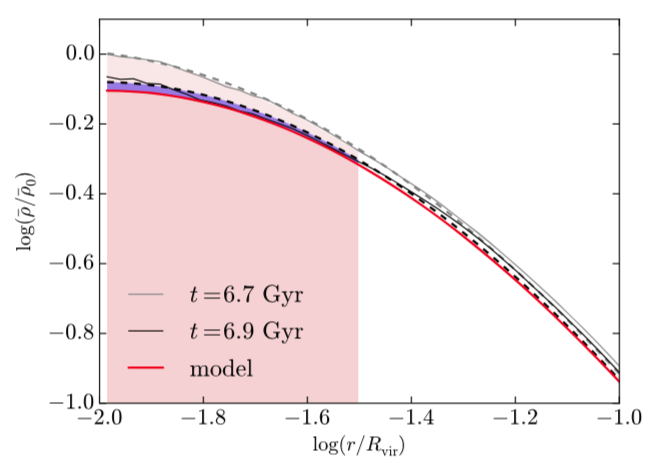

<h2> Testing the CuspCore model with the NIHAO cosmological simulations</h2>

These python programs test the CuspCore model against the NIHAO cosmological zoom-in simulations, as presented in <a href="https://ui.adsabs.harvard.edu/abs/2020MNRAS.491.4523F/abstract"  style="text-decoration:none" class="type1"><b>Freundlich et al. (2020a)</b></a>. This model (which is also summarized <a href="https://ui.adsabs.harvard.edu/abs/2019sf2a.conf..477F/abstract"  style="text-decoration:none" class="type1">here</a>) describes the response of a dissipationless spherical system to an instantaneous mass change at its centre. It is meant to describe the formation of flat cores in dark matter haloes and ultra-diffuse galaxies from feedback-driven outflow episodes. The python programs here also enable to fit the <a href="https://ui.adsabs.harvard.edu/abs/2020arXiv200408395F"  style="text-decoration:none" class="type1"><b>Dekel-Zhao profile</b></a> on the simulated haloes, to test their Jeans equilibrium, and to plot the figures of the article. 

 The analysis is divided into different steps:

<u><b><a href="formatting.md">1/ Formatting the data.</a> </b></u>From the simulation outputs, we derive radial profiles of the quantities of interest in order to manipulate smaller files in the next steps.  
 

<a href="treal.md"><u><b>2/ Deriving the real kinetic energy profile</b></u>,</a> to test Jeans equilibrium and compare with the models.  
 

<u><a href="prepare.md"><b>3/ Preparing the data.</b></a> </u>We derive useful quantities from the profiles, in particular smoothed density and velocity dispersion profiles, their logarithmic slopes, the smoothed anisotropy parameter, the mean density profile.  
 

<u><b><a href="fitting.md">4/ Fitting the density profiles.</a> </b></u>We fit the density profiles using the <a href="https://ui.adsabs.harvard.edu/abs/2020arXiv200408395F"  style="text-decoration:none" class="type1">Dekel-Zhao profile</a>. Note that the programs use a 1/b=2 convention. 
 

<b><a href="Section42_Fig9_single.ipynb"><u>5/ Testing the model.</u></a> </b>We obtain the model prediction for the next timestep from the mass variations at each radius and compare it with the actual DM density profile. We also plot the mass variation profiles, the logarithmic slopes and the kinetic energy for a better understanding of the model. The function cuspcore_go.go() carries the different steps automatically for a given set of input parameters.  

