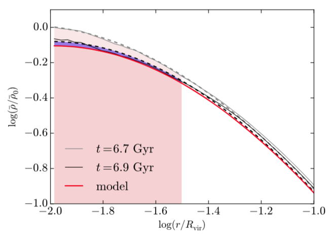

<h2> Testing the CuspCore model with the NIHAO cosmological simulations</h2>

These python programs test the CuspCore model against the NIHAO cosmological zoom-in simulations, as presented in <a href="https://ui.adsabs.harvard.edu/abs/2020MNRAS.491.4523F/abstract"  style="text-decoration:none" class="type1">Freundlich et al. 2020a</a>. This model (which is also summarized <a href="https://ui.adsabs.harvard.edu/abs/2019sf2a.conf..477F/abstract"  style="text-decoration:none" class="type1">here</a>) describes the response of a dissipationless spherical system to an instantaneous mass change at its centre. It is meant to describe the formation of flat cores in dark matter haloes and ultra-diffuse galaxies from feedback-driven outflow episodes. The python programs also enable to fit the <a href="https://ui.adsabs.harvard.edu/abs/2020arXiv200408395F"  style="text-decoration:none" class="type1"><b>Dekel-Zhao profile</b></a>, to test Jeans equilibrium, and to plot the figures of the article. 

