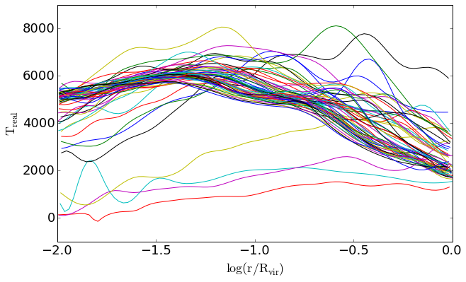

<b>CREATION OF A DATA FILE CONTAINING THE REAL KINETIC ENERGY WITH treal_functions.load_or_create_gl() 
 
</b>###################################### 
 

For each snapshot i, this function creates an array Treal such that Treal[i]=[r,Rvir,Tr].  
 

<u><b>Notes: </b></u> 
<i> 
- The radii r are taken from the files NIHAO-xxx.pickle containing the profile and flow data 
 
- It is possible to choose Rvir from the simulation haloes or from Fangzhou's data 
</i> 

###################################### 
 

<b><u>Usage: </u></b> 
 
import sys 
sys.path.insert(0, '/cs/sci/freundlich/CUSPCORE/Analysis/Formatting') 
import treal_functions 
reload(treal_functions) 
 
sims =['g1.37e11','g1.52e11','g1.57e11','g1.59e11','g2.19e11','g2.63e10','g8.06e11'] 
 
for sim in sims: 
&nbsp;&nbsp;&nbsp; treal_functions.load_or_create_gl(sim,directory='/cs/sci/freundlich/CUSPCORE/Analysis/DATA/',use_fangzhou_Rvir=True) 

 
###################################### 
 

<b><u>Treal profiles for galaxy g1.08e11 (all snapshots):</u></b> 

 

 

 
by Jonathan Freundlich (13/03/2018)

 

